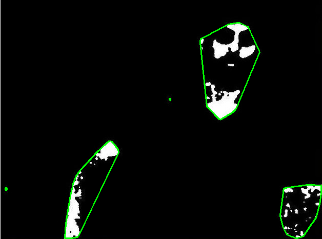
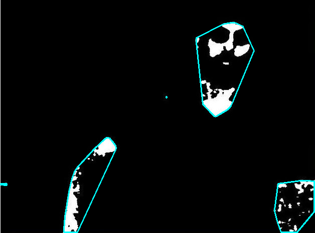

Thanks for yours informations/codes Abid Rahman K &amp;
bjoernz.
I have re-implemented yours techniques, brute force and morphological operations ("optimized" in term of GPU/CPU usages).

Here some results and timing:

Brute force method (from Abid) => 3.05s

Morpho Operation (from bjoernz) => 0.074s

Results from both techniques seems to be very close but timings are very different ^^ the scale factor close to ~41x (GPU rock for pixels manipulation ^^).

My computer settings: 

<ul>
<li>CPU: Intel(R) Core(TM) i5-4440 CPU @ 3.10GHz</li>
<li>GPU: NVidia GeForce GTX 750Ti</li>
<li>(OS: Linux/Mint17 - OpenCV 3.1.0)</li>
</ul>
